# AHK-XAML Visual Showcase

Welcome to the **AHK-XAML** visual showcase. This document highlights the premium design aesthetics, modern components, and powerful Developer Tools built into the framework.

Most layouts and components demonstrated here are highly flexible **Proofs-of-Concept (PoCs)** or **DIY prototypes** rather than rigid, production-hardened controls. They are designed to show off the massive visual flexibility of AHK-XAML—proving that you can easily build your own custom layouts, vector canvases, and interactive widgets directly in AutoHotkey with minimal code.

### 🌟 Component Status Key
- 💎 **Integrated Core / Wrappers:** Fully integrated, stable framework features or native control wrappers (like AvalonEdit).
- 🧪 **Proof of Concept (PoC) / DIY Demos:** Visual prototypes built using basic XAML layout elements (Grids, StackPanels, Shapes, Canvas) to demonstrate how easily you can design complex behaviors.

---

## 1. Live Interactive Developer Tools

AHK-XAML includes a comprehensive, built-in Developer Tools panel (accessible via `F12` or calling `XAML_DevTools.ShowFor(app)`) that provides real-time diagnostics, visual tree inspection, and IPC payload monitoring.

### 💎 Live Element Picker & Tree Inspector
Inspect the live WPF visual tree, mouse-hover over elements to highlight their boundary boxes, and view computed styles, box model dimensions, and control properties instantly.

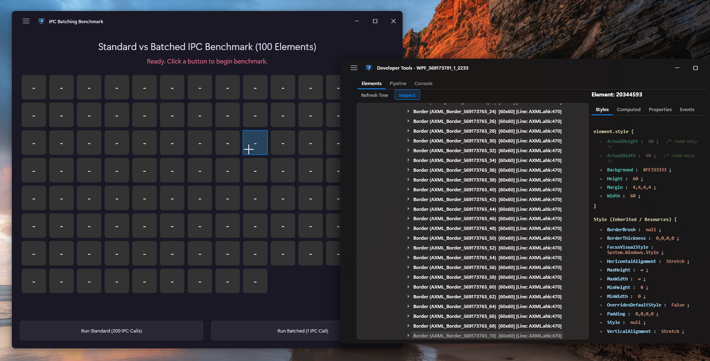

### 💎 IPC Message Payload Analyzer
Inspect live IPC traffic between the AutoHotkey process and the .NET WPF engine. It displays length-prefixed protocol messages, event triggers, and update commands in real-time.

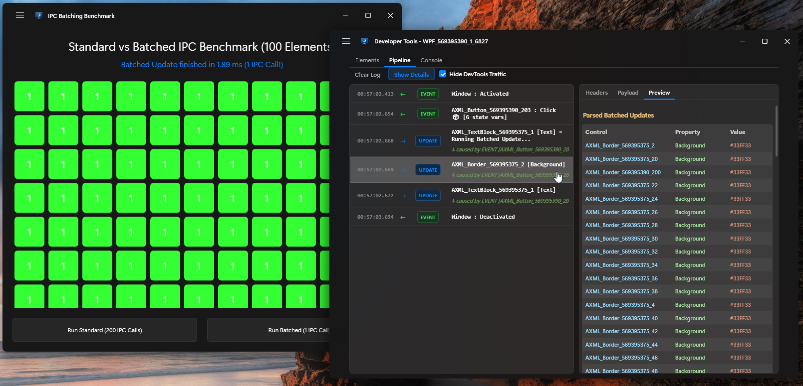

---

## 2. Advanced Custom Controls & IDE Components

AHK-XAML supports complex, stateful components that combine native performance with fluid layouts.

### 💎 AvalonEdit IDE & Code Editor
Full integration with **AvalonEdit** (the engine behind SharpDevelop), providing rich text syntax highlighting, code folding, line numbering, autocomplete popups, and caret tracking.

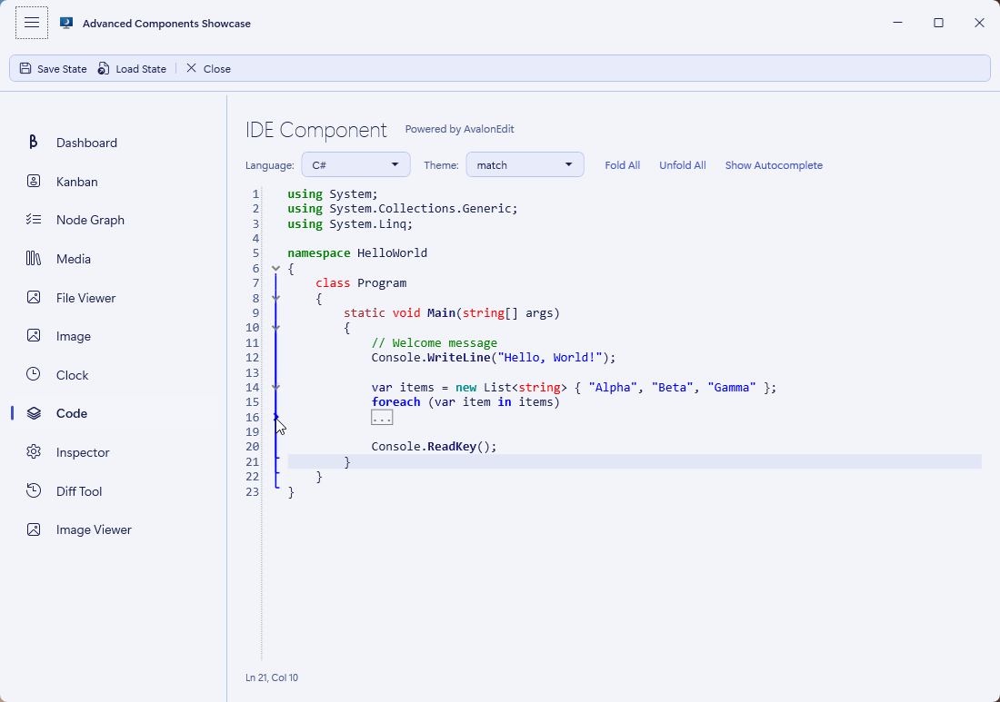

### 💎 WebView2 Integration
Full support for the Microsoft WebView2 control, allowing developers to embed modern web views, execute JavaScript asynchronously, and build hybrid desktop applications.

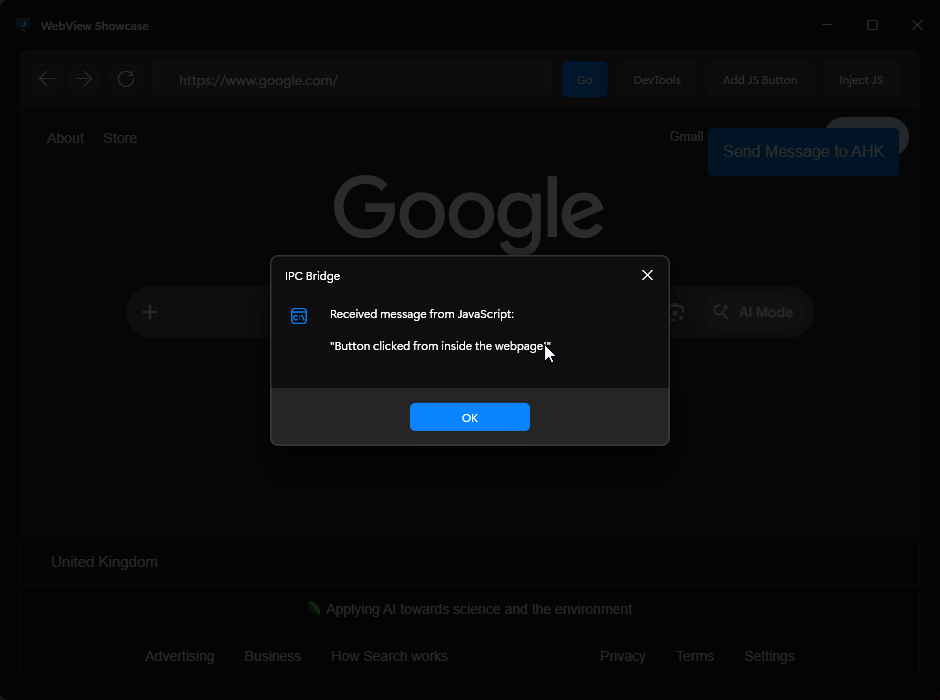

### 💎 Tokenizing Search Input (Tags)
Type tags split by custom delimiters (comma or space), double-click to edit, and remove tags with optional confirmation dialogs.

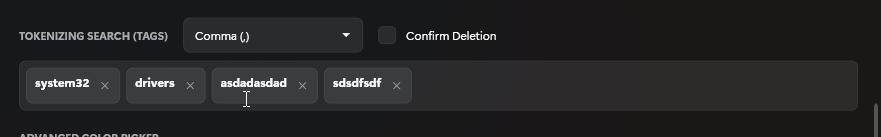

### 💎 HotKey Capturer & Input Controls
Easily capture user keystroke combinations for shortcuts and hotkeys dynamically.

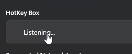

### 🧪 Visual Node Graph Canvas (PoC / DIY)
An interactive node graph editor built using canvas vector shapes. Drag-and-drop nodes, create links and connector wires, and visualize data flow structures. This demonstrates how you can construct custom vector-based canvas widgets easily.

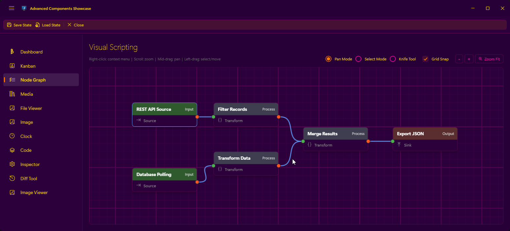

### 🧪 Stateful Kanban Board (PoC / DIY)
A responsive Kanban board component featuring column states, drag-and-drop card sorting, tag badges, and custom event callbacks.

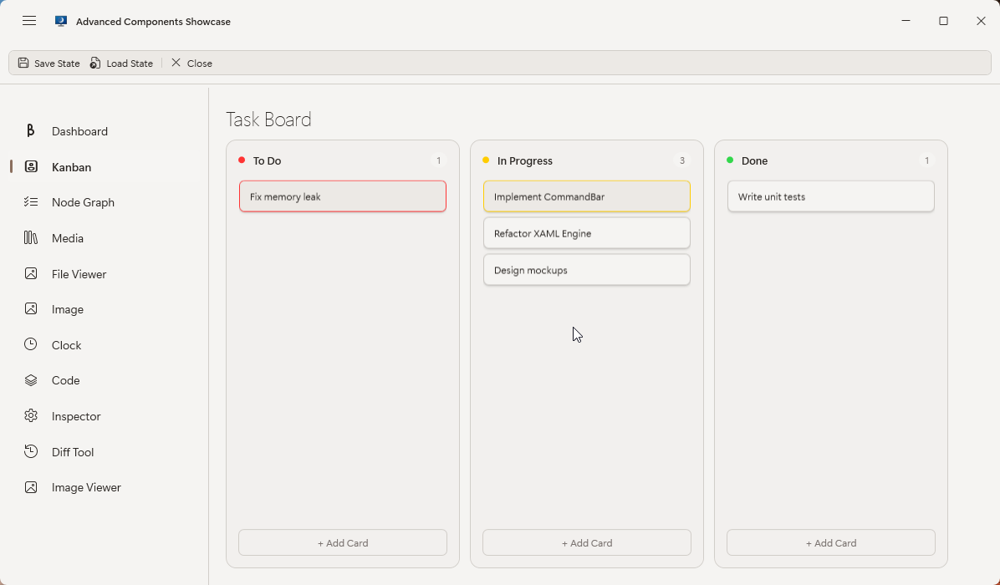

---

## 3. Rich Document & Text Editing

Create office-level application clones with full styling capabilities.

### 🧪 Google Docs-style Rich Editor (PoC / DIY)
A complete document editor with DOCX/DOC support, alignment formatting, tables, images, hyperlinks, search/replace dialogues, and word counters.

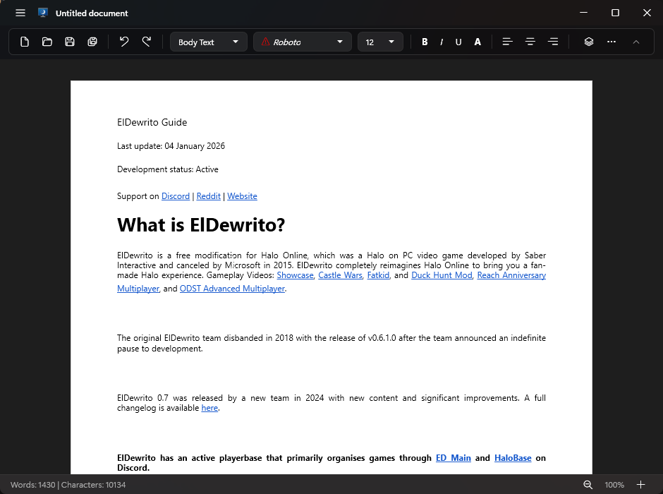

### 🧪 Dark Document Mode & Theme Synchronization (PoC / DIY)
A non-destructive dark/themed document mode that preserves background and text colors while matching the main application shell's theme.

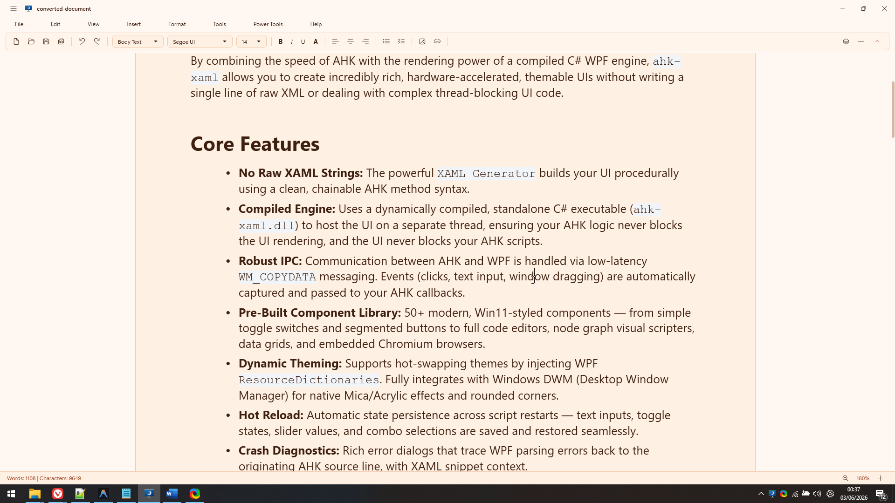

---

## 4. Modern Windows 11 Styling & Glassmorphism

WOW your users with state-of-the-art designs leveraging HSL color palettes, dark modes, and dynamic backdrops.

### 🧪 Glassmorphism & Frosted Backdrops (PoC / DIY)
Stunning UIs utilizing Acrylic or Mica backdrops, glassmorphism list boxes, rounded card borders, and smooth highlight micro-animations.

| Glassmorphic Listbox | Acrylic Real-time Blur Effect |
| :---: | :---: |
| 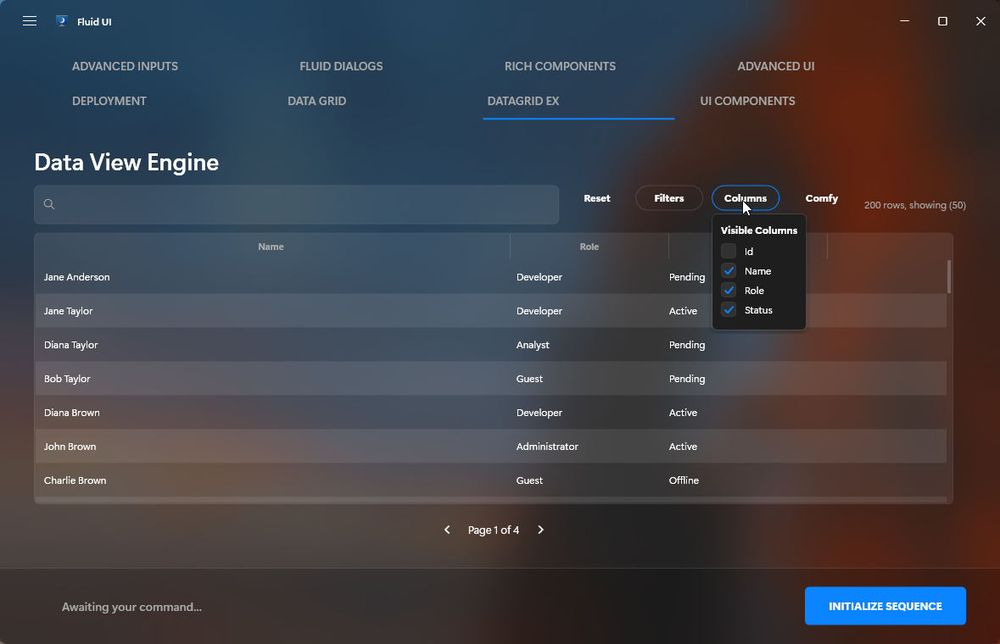 | 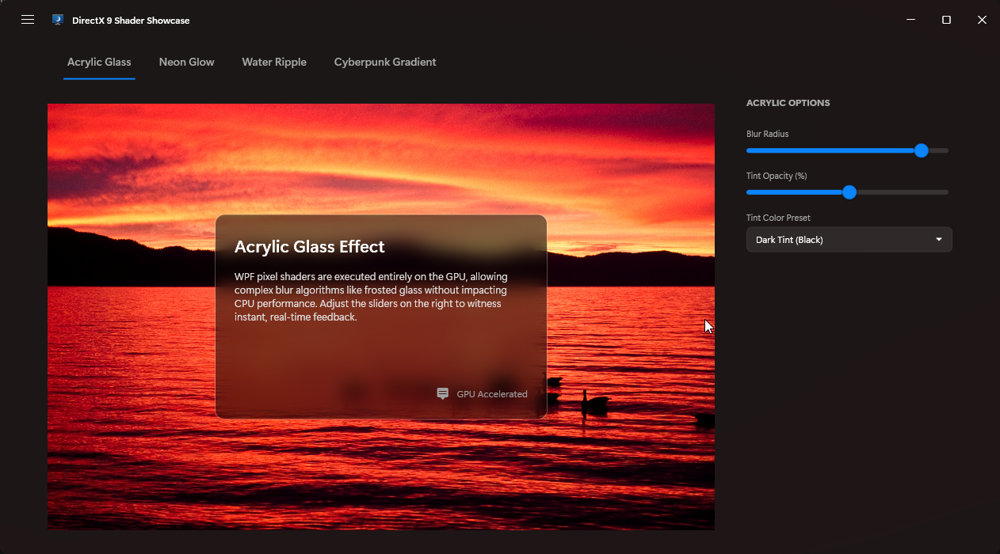 |

### 🧪 VS Code-inspired IDE Shell (PoC / DIY)
A modern, dark-mode VS Code clone showing responsive side panels, file explorers, custom status bars, and custom scrollbar styles.

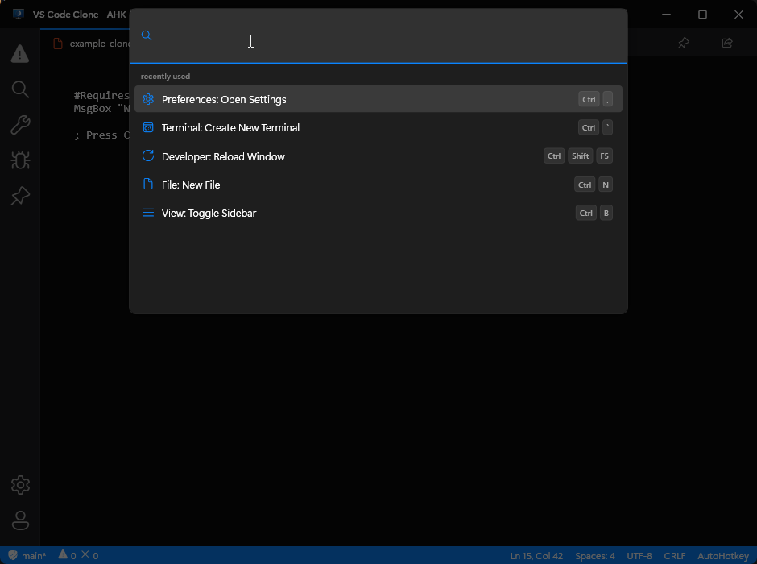

### 🧪 Tabbed Chromium Title Bar (PoC / DIY)
A custom, borderless window featuring a tabbed title bar, back/forward buttons, extensions popovers, and profile selectors.

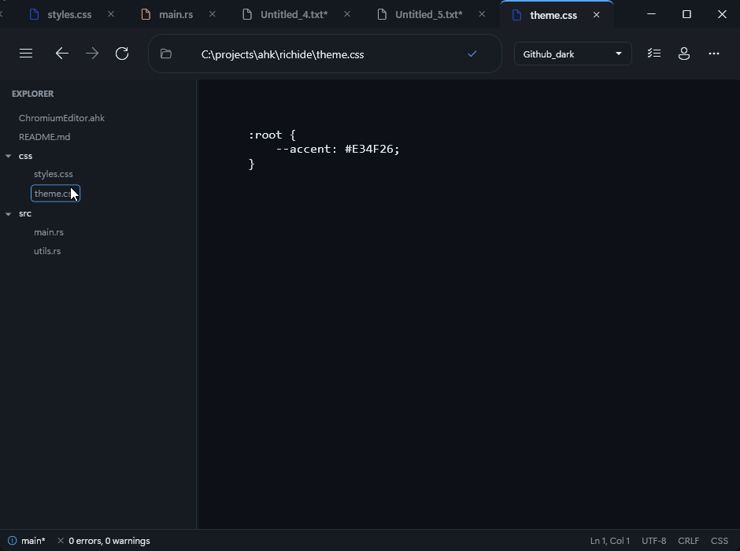

---

## 5. Overlays, Dialogs, and Popovers

AHK-XAML provides robust layouts for flyouts and popovers that overflow parent containers cleanly.

### 🧪 Fluent Color Picker (PoC / DIY)
A highly responsive 2D Color Picker dialog featuring full HSV/RGB and hex value binding, hue and alpha sliders, presets, and owner-window modal blocking.

| Dark Themed Picker | Simple Light / Themed Inline Picker |
| :---: | :---: |
| 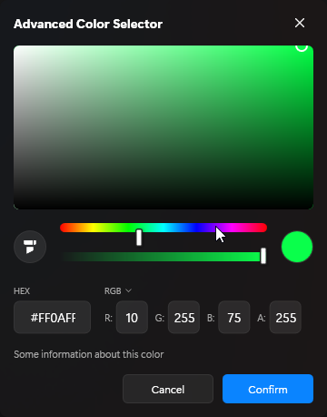 | 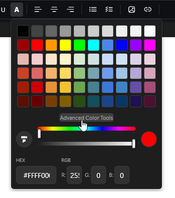 |

### 💎 Side Flyout Panels
Draggable right/left flyout panels that slide smoothly on top of existing UI elements for configuration settings or properties panels.

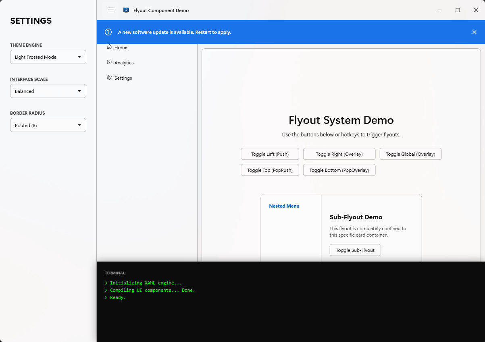

### 💎 Rich Component Popovers
Inline popover dialogs that attach directly to button triggers for complex alignments, lists formatting, font coloring, and table compilers.

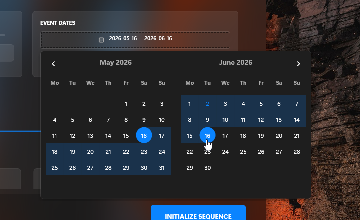

### 💎 Rich Context Menus
Native-styled context menus with icons, shortcut gestures, and custom actions.

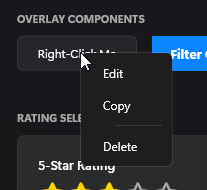

### 🧪 Breadcrumb Popover (PoC / DIY)
Interactive breadcrumbs that support popover drop-down navigation for deeply nested hierarchies.

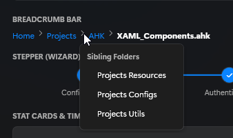

---

## 6. Multi-Window Snapping & Docking

AHK-XAML supports dynamic and complex window alignments.

### 💎 Snapping & Pinned Docking (Panel Manager)
Dynamic snap points, glued multi-window dragging with relative offset tracking, and persistence state saving.

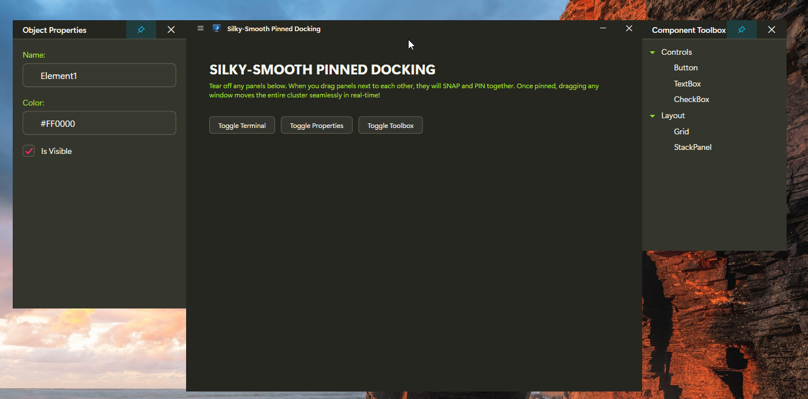

---

## 7. Classic OS Skins & Nostalgic Themes

Demonstrates the adaptability of the layout system to render pixel-perfect replicas of classic operating system interfaces.

### 🧪 Retro Windows Skins (PoC / DIY)
Recreate nostalgic designs with retro borders, classic command buttons, and authentic color schemes.

| Windows 95/98 Classic Theme | Windows XP Luna Theme |
| :---: | :---: |
| 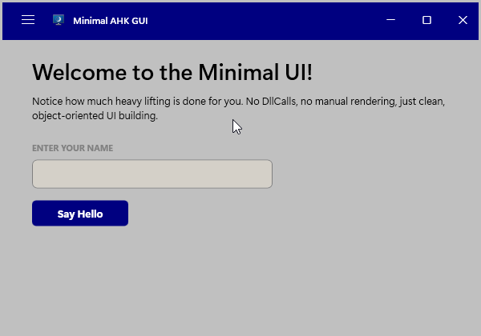 | 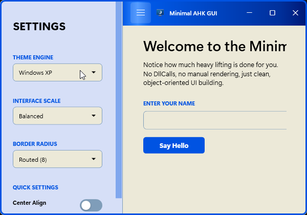 |

---

## 8. Alternative Aesthetics & Creative UI Skins

AHK-XAML lets you break free from standard Windows controls entirely. You can craft bespoke, themed interfaces targeting gaming, media players, hardware monitors, and unique branding.

### 🧪 Cyberpunk Retro Dashboard (PoC / DIY)
A dark, neon-themed terminal dashboard featuring radial analog gauges, live charts, and glowing vector status panels.

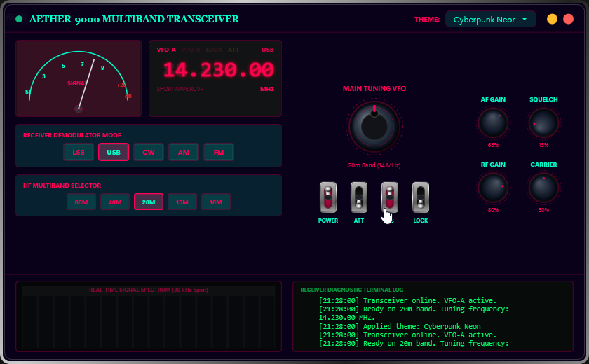

### 🧪 Neumorphism Music Player (PoC / DIY)
Soft shadows and clean inset/outset drop-shadow highlights creating a premium, tactile neumorphic application interface.

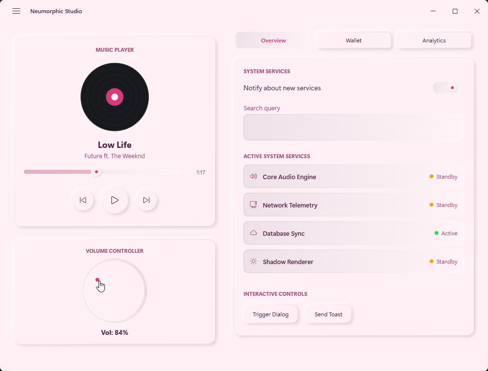

### 🧪 Fantasy RPG Game UI (PoC / DIY)
Immersive fantasy launcher or settings dialog featuring gold-trimmed borders, Gothic typography, and atmospheric dark paneling.

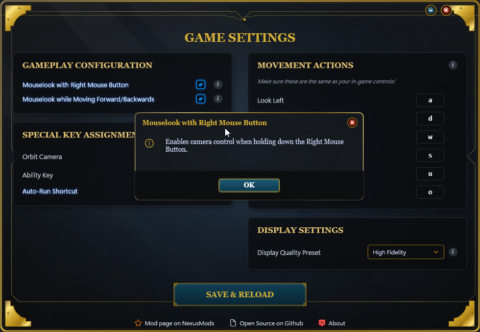

### 🧪 Cozy / Cushy Utility UI (PoC / DIY)
A warm, friendly green interface featuring soft rounded shapes, conversational options, and simplified sliders.

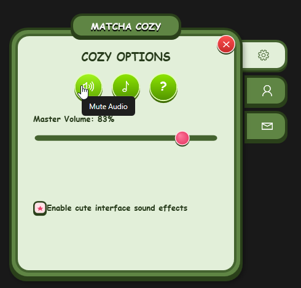

### 🧪 Circular Console & OBD Dial (PoC / DIY)
A fully custom circular hardware monitor window with outer glowing status rings and radial dial markers.

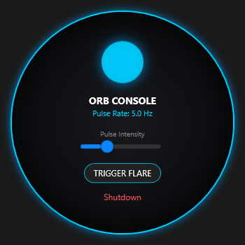

### 🧪 Animated Neon Gradients & Custom Layouts (PoC / DIY)
Smoothly animated multi-color gradients shifting in the background, showing off high-performance canvas rendering.

| Animated Neon Gradient | Multi-Panel Sunset Layout |
| :---: | :---: |
| 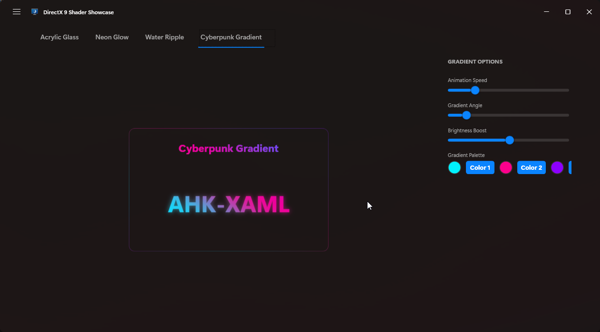 | 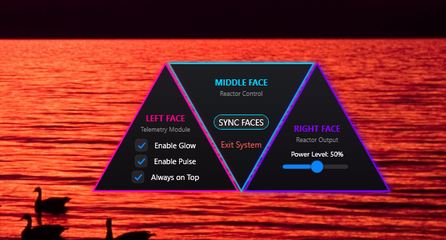 |

---

## 🚀 And More...

There is so much more you can build with AHK-XAML! 

To explore these features in action, download the repository and check out the interactive examples:
- [basic_components.ahk](examples/showcase/basic_components.ahk): The primary playground for widgets, inputs, and customization.
- [document_editor.ahk](examples/clones/document_editor.ahk): The themed Microsoft Word/Google Docs clone.
- [pinned_docking.ahk](examples/showcase/pinned_docking.ahk): The panel docking alignment showcase.
- [nodegraph.ahk](examples/showcase/nodegraph.ahk): The vector nodegraph editor canvas.
- [win11_settings.ahk](examples/clones/win11_settings.ahk): Features a comprehensive settings interface and a theme switcher showing 21 different themes including classic `[Win97]` and `[Windows XP]`.
- [shader_effects.ahk](examples/showcase/shader_effects.ahk): Showcases GPU-accelerated DirectX 9 pixel shaders (Acrylic Blur, Neon Glows, Water Ripples, and Animated Gradients).
- [cozy_settings.ahk](examples/unique_guis/cozy_settings.ahk): Cozy options and setup dialog prototype.
- [game_settings.ahk](examples/unique_guis/game_settings.ahk): Gold-trimmed Dark Fantasy RPG settings menu.
- [neumorphism.ahk](examples/unique_guis/neumorphism.ahk): Tactile neumorphic music player dashboard.
- [orb.ahk](examples/unique_guis/orb.ahk): Circular monitor hardware dial console.
- [retro_transceiver.ahk](examples/unique_guis/retro_transceiver.ahk): Cyberpunk transceiver interface with neon radial gauges.
- [pyramid.ahk](examples/unique_guis/pyramid.ahk): Sunset vector canvas dashboard layouts.

Launch any example with AutoHotkey v2 to experience the speed, responsiveness, and beauty of AHK-XAML first-hand!
